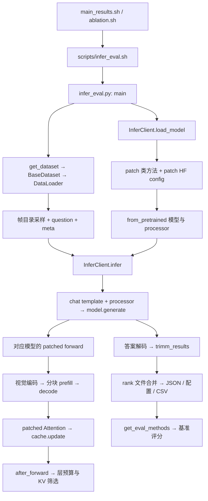

# AdaReTaKe 项目理解与开发基线

记录日期：2026-09-08。源码基线：`39223a693e37dc9806fb7d03fac764bddf86fbb3`。

本记录依据当前仓库的 AGENTS.md、README、全部核心 Python 模块、实验 YAML、执行脚本、数据构建与提交脚本。它描述实际实现；文档中的预期结果不代表本次已复现。后续变更应同步更新相关结论，并重新核对当前源码。

## 1. 项目范围与结构

这是长视频多模态模型推理与评估代码，核心是视觉分块编码、语言模型分块 prefill、问题引导 KV 压缩、时间与层间预算分配。当前主要实验使用 Qwen2.5-VL；还保留 Qwen2-VL 和基于 LLaVA-OneVision 的 LLaVA-Video 分支。未发现训练入口、自动化测试目录、打包配置或 CI 配置；不能因为 forward 有 labels/loss 参数就认为分块训练受支持。

| 路径 | 职责与依赖 |
|---|---|
| `demo.py` | 单视频三个问题；视频/帧目录读取、模型加载、processor、generate；部分逻辑与评估入口重复 |
| `main_results.sh` | 顺序运行四个主实验；模型路径写在脚本中 |
| `ablation.sh` | 四个数据集 × 四种 1024 帧消融；模型路径是占位值 |
| `scripts/infer_eval.sh` | 设置 PYTHONPATH，转发权重、YAML、GPU 数、抽帧 FPS 及额外 CLI 参数 |
| `retake/infer_eval.py` | 参数解析、加载模型、按 rank 切分数据、生成、答案清洗、断点缓存、结果合并、评估与配置保存 |
| `retake/monkeypatch.py` | 显式替换 Transformers 类方法；把 YAML 参数注入 HF config；导入所有模型适配模块 |
| `retake/qwen2_5_vl.py` | 主模型 attention/forward、模态切段、分块、问题引导、时间预算计算、部分新旧 HF 接口适配 |
| `retake/qwen2_vl.py` | 旧 Qwen 分支；额外支持视觉 token 压缩；复用 Qwen2.5 时间预算函数 |
| `retake/llava_onevision.py` | 视觉塔、投影、池化、Qwen2 attention 替换、LLaVA 分块及专用时间预算函数 |
| `retake/longvideo_cache.py` | DynamicCache 派生类、打分、预算分配、KV 淘汰、位置缓存与 RoPE 重编码 |
| `retake/visual_compression.py` | MA-LLM 加权合并、hard 替换、Keyframe/patch 选择；由 Qwen2 和 LLaVA 调用 |
| `retake/dataset_utils.py` | 统一标注加载与帧采样、四基准评分；可选 MLVU 生成式评分代码 |
| `configs/` | demo、NPU、三模型家族、基准与消融的独立 YAML |
| `scripts/utils/` | ffmpeg 抽帧、四基准统一标注构建、MLVU test 构建、LLaVA 权重转换 |
| `scripts/submission/` | 将结果转成提交格式；部分沿用旧预测文件接口 |
| `docs/prepare_*.md` | 数据准备说明；其中下载命令与路径需在真正准备数据时再核对 |
| `misc/` | demo 视频和框架图片 |
| `requirements.txt` / `environment_npu.yaml` | GPU 与 NPU 依赖，版本并不相同 |

`retake/` 当前没有 `__init__.py`，以 namespace package 方式导入；补丁不是执行 `import retake` 就自动安装，而是在加载模型时调用 `patch_*()`。补丁修改进程内的类，影响同一进程后续实例，未提供恢复原方法的统一机制。LLaVA 还会替换通用 `Qwen2Attention` 的构造和 forward。

## 2. 执行与调用链

普通多 GPU 模式是每个 rank 一份完整模型、按 `dataset_index % world_size` 分配样本，使用 `mp.spawn` 和 NCCL；不是 DDP 训练。单卡直接调用 main。`--auto_sharding` 使用单进程、`device_map='auto'` 跨卡放置模型，数据 world_size 为 1。

`demo.py` 自己加载 YAML 和模型，使用 OpenCV 读取原始视频或读取抽帧目录，再逐问题生成。它不调用 BaseDataset 或基准评分，也只是打印期望答案，没有断言三个答案正确。

## 3. Qwen2.5-VL 主推理流程

1. processor 生成 input_ids、mask、视频像素与 `video_grid_thw` 等输入。forward 明确要求 batch size 为 1；数据入口只使用一个视频。
2. `cache_position[0] == 0` 标识 prefill；根据完整输入长度计算 `r = min(1, max_input_length / input_length)`，写回 config 的压缩参数。这里 r 是保留比例。
3. 存在 `chunked_prefill_frames` 才启用分块并调用 `build_kvcache()`。没有分块时不会仅凭压缩开关自动建立此压缩流程。
4. 根据视频 token ID 将输入切成 text/video 段。构建多模态 RoPE 位置；视觉编码按 grid 时间维分块，拼接所有视觉 embedding 后写入输入 embedding 的对应位置。
5. 压缩开启时提前计算每个视频 chunk 的绝对保留比例。关闭时间自适应则返回相同的 r；开启时按视觉 embedding 聚合、相邻 chunk 余弦距离分配，再用二分投影限制在 `[1e-3, 1]`，目标比例之和为 `r * num_chunks`。
6. 文本段关闭压缩。视频块通过 `forge_input_chunks()` 临时附加最后文本段的尾部作为引导；`max_guide_length` 限制的是这段引导，不是最终输入问题/字幕的总长度。
7. 视频块调用 `before_forward(prompt_length, position_ids)`、设置该块比例，然后执行语言模型。各层 attention 将 Q、K、V、位置和 rotary 信息传给 cache.update。
8. StandardVidLangKVCache 在 update 中算问题 query 对当前视频 key 的注意力分数。正常压缩路径从持久缓存剔除临时引导文本，而当前 attention 使用完整追加的 KV。所有层完成后 `after_forward()` 分配层预算，对当前块做排序 top-k，保留之前已缓存的 token。
9. 处理真正的后续文本并关闭压缩，之后走常规自回归 decode。入口固定 `max_new_tokens=128`。

位置相关对象要一起理解：`cache_position` 是生成流程的序列位置，`position_ids` 是 RoPE 位置，`position_cache` 是各层保留 token 的位置记录，`rope_deltas` 衔接多模态 prefill 与 decode；它们不能简单互换。

Qwen 的 chunk token 数实际公式为 `min(chunked_prefill_frames, T) * H * W // (spatial_merge_size² * temporal_patch_size)`；视觉编码的 frame_chunk_size 则直接切 grid_t。配置名称里的“帧”不能未经 processor 张量核对就一律当成原视频帧数。

## 4. 缓存类与模型差异

| 缓存 | 选择字符串 | 行为 |
|---|---|---|
| DynamicCache | 关闭压缩 | 标准缓存 |
| PivotKVCache | `pivotkv` | 当前块自注意力打分，在 update 中筛选，支持关键 patch 优先和位置重编码 |
| VidLangKVCache | `vidlkv` | 问题引导打分，在每层 update 内压缩；层分配支持 even、pyramid、源码拼写 `emprical` |
| StandardVidLangKVCache | `stdvidlkv`（忽略下划线） | 收集层分数，在 after_forward 中压缩；层分配支持 even、adakv；支持接收时间比例 |

Standard 的 AdaKV 实际是把各层 token 分数拼接，做全局 top-k，再按各层入选数量（含初始平滑计数）分配比例；不是直接计算“各层方差”。各层选择的 token 索引在头之间共享。最低保留比例、整数截断和每层至少保留一个 token 都会改变精确预算，因此 `max_input_length=16000` 是比例目标，不能当作实际缓存的严格总长上限；文本保留与不等长末块也会影响总量。

`pos_embed_reforge` 涉及解除原 RoPE、压缩时间位置并重新旋转 key。Standard 使用 `_base_compression_ratio` 缩放位置，而非当前时间自适应比例；变更此处需要同时验证 attention 的位置连续性和缓存位置。

Qwen2.5 主分支没有调用 `compress_video_tokens()`；视觉 token 压缩工具主要属于 Qwen2 和 LLaVA 的旧 ReTaKe 路径。Qwen2 复用主分支时间预算函数；LLaVA 有独立函数，视觉特征经过 vision tower、projector、pooling 后进入语言模型。三条模型路径并非完整对称实现。

## 5. 配置系统

YAML 经 `yaml.safe_load` 读成普通 dict，没有配置继承、schema 校验或通用 CLI 深层覆盖系统。每个实验文件独立完整。

| 层级 | 字段与消费位置 |
|---|---|
| CLI | hf_path（别名 hf_qwen2vl7b_path）、model_name、config_path、n_gpus、auto_sharding、video_frame_extraction_fps、enable_cache、skip_eval、timeout |
| YAML 顶层模型 | model_name；method 目前仅支持 retake；attn_implementation 传给 from_pretrained；scaling_factor 注入 YaRN |
| YAML 顶层数据 | dataset_name、anno_file、dataloader_num_workers、sample_fps、max_num_frames、longsize_resolution |
| YAML 生成/输出 | do_sample、output_dir；demo 实际写死 do_sample=False |
| longvideo_kwargs | frame_chunk_size、chunked_prefill_frames、kvcache_compression；旧分支还消费 visual_compression 及其 kwargs |
| kvcache_compression_kwargs | compression_method、dynamic_compression_ratio、compression_ratio、max_input_length、prompt_guided_compression、max_guide_length、pos_embed_reforge、enable_temporal_adaptation、budget_allocation_method 等 |

CLI 的 model_name 非空时优先于 YAML；模型权重来自 CLI。sample_fps 来自 YAML，脚本第 4 个参数是已经抽取的帧目录 FPS，不是推理采样 FPS。相对数据和输出路径依赖启动工作目录，wrapper 没有自行 cd 到仓库。

主 Qwen2.5 配置共同使用 16k 比例目标、32 prefill 分块参数、64 视觉分块参数、448 长边、scaling_factor=4、问题引导、stdvidlkv、时间自适应和 AdaKV。

| 数据集 | 无后缀 YAML 最大帧数 | sample_fps | reforge | 特殊项 |
|---|---:|---:|---|---|
| LongVideoBench | 2048 | 2 | false | max_guide_length=152；构建标注时加入字幕 |
| LVBench | 2048 | 2 | true | main_results.sh 实际选用 f1024 文件 |
| MLVU | 2048 | 2 | false | M-AVG 与 M-AVG-sample 是不同口径 |
| Video-MME | 2048 | 4 | true | 默认标注不含字幕 |

四组 f1024 消融均为 1024 帧、2 FPS：无后缀为 full；no_both=关闭时间+even；no_layer=开启时间+even；no_temporal=关闭时间+adakv。关闭两个自适应模块仍然保留问题引导 KV 压缩。所谓 base 配置仍执行 method=retake 的补丁，只是缺少 longvideo_kwargs；不能等同完全未修改的 HF forward。

demo YAML 中 `temporal_adaptation_ratio: 4` 在当前实现没有消费点；实际时间开关是 enable_temporal_adaptation。运行时还存在 128 新 token、NCCL 12355 端口等硬编码，不能沿用“所有参数都在 YAML”这一文档概括。

## 6. 数据与评估契约

统一 JSON 每条记录具有 `messages=[user question, assistant answer]`、`videos=[帧目录]` 和 `meta`。meta 可为 dict 或 JSON 字符串。BaseDataset 删除问题中的 `<video>`，由 processor chat template 重新插入视频；返回的 idx 是标注数组下标，不是 benchmark 的原始 question_id。后者在 meta 中。

批量评估只读取排序后的帧目录文件；根据目录文件数和 extraction_fps 推算时长，以 linspace 均匀采样并向下取偶数帧，缩小长边、转 RGB。空目录或采样为零返回 None，推理循环跳过；缺失目录仍会报错。评分只遍历实际结果，所以跳样本会改变指标分母。

LongVideoBench 构建器将字幕放在问题前部，超长字幕按 8000 个空格分词项截断。Video-MME 构建器分别生成带/不带字幕 JSON，默认实验选不带字幕。MLVU 构建器包含 7 种选择题和 2 种生成任务。

| 基准 | 实际本地评分 |
|---|---|
| LVBench | 按多标签 question_type 和 overall 统计准确率 |
| LongVideoBench | question_category × duration_group；overall 为样本准确率 |
| Video-MME | task_type × duration；overall 取各时长组均值，代码假设组内样本数相同 |
| MLVU | M-AVG 为 7 类准确率宏平均，M-AVG-sample 为选择题样本平均；G-AVG 有单独路径；test 本地评分未实现 |

输出包括 `anno_id2result.json`、`anno_id2meta.json`、`config.yaml`、`infer_results.csv`、`eval_results.csv`；skip_eval 时不生成评估 CSV。可选断点文件在 output_dir/cache/配置文件名下；汇总临时文件在 `_gather_tmp/`。配置保存包含 CLI 和执行时间，但实际动态比例写在模型 config 中，不能认为保存 YAML 已包含全部逐样本派生状态。

## 7. 已确认的不一致与待验证问题

以下是后续工作的影响分析输入，本次没有修改算法或修复这些问题。

**静态确认的行为或接口差异：**

- README 的 LVBench 主结果是 2048 帧，而 main_results.sh 调用 f1024；AGENTS.md 还有旧目录名称、旧行号等描述。分数对应实验必须按实际 YAML 和输出元数据追踪。
- infer_eval 对所有答案执行 trimm_results，只保留首个 A–G 大写字母或空串，未保存完整生成文本。MLVU 生成式评分默认关闭，入口也未传开启参数。
- dataset_utils 在导入 openai 前把 os.environ 项赋为 None，该操作会抛 TypeError 并被宽泛 except 捕获，不能根据打印信息判断包未安装。生成评分还期望 meta.question 与 meta.original_answer，当前数据/推理链未补齐，单装依赖不足以启用它。
- MLVU test、Video-MME 提交脚本读取 generated_predictions.jsonl，当前 infer_eval 不生成该文件。LVBench 提交器读取 eval_results.csv。
- 单卡普通模式不初始化进程组，但 gather_results 仍调用 barrier；异常后走文件 fallback。断点恢复把本 rank 的迭代计数与全局 dataset index 混用，多卡恢复语义需要修正前先设计验证。
- 普通多卡端口固定 12355。汇总文件未按 run 隔离；fallback 仅检查 result 文件存在，未同时确认 meta、写入完成和本轮身份。
- requirements 固定 torch 2.6.0、transformers 4.57.0；NPU 环境固定 torch/torch-npu 2.4.0、transformers 4.45.2。不能把 NPU 文件视为当前全部模型分支的已验证环境。

**源码显示风险，尚未以实际模型复现：**

- Qwen2-VL 的 Transformers 4.57 层级、attention 签名和返回值兼容已修复，并以本地 7B 权重完成 256 帧压缩冒烟和 2048 帧完整 demo。Qwen2.5-VL 仍应在目标 Transformers/权重组合上独立进行 smoke test。
- 时间预算函数使用的 Qwen t_factor、embedding 截取/reshape 与实际视觉 token 布局需通过张量形状和已知帧标记核验；时间聚合均匀分帧，而 prefill 是固定 token 分块，非整块输入未必对齐。LLaVA 时间函数按每帧额外一个 newline 推算，但 forward 在整个视频序列末尾加一次 newline，布局同样需核对。
- Standard 的文本路径会 append 高分到 attn_cumscores_cache，而 before_forward 不清空它；首个视频块前的文本分数可能干扰按层索引/预算，需检查一次完整 prefill 的缓存生命周期。
- 时间比例投影可到 1；该块如果已附加引导文本，Standard 的不压缩分支保留全部 KV，没有正常压缩分支的临时引导清理。需检验缓存长度与下一块语义。
- AdaKV 生成的单层比例未显式限制在 1 内，after_forward 的 top-k 没有 keep_len≤k_len 的上界保护；需构造分数高度集中等边界验证。
- 压缩后的各层实际 KV 长度、原始 attention_mask/cache_position 与不同 attention backend 的匹配，需要分别验证；不能仅由 FlashAttention 成功推断 eager/SDPA 成功。
- BaseDataset 在偶数帧取整前计算 sampling_fps，demo 在取帧后计算，奇数候选帧数时会不同。Qwen2.5 的时间位置可能受其影响。
- 旧分支视觉压缩会改 token 序列，但模态段/chunk 等在它之前计算；若将视觉 compression_ratio 从现有 1.0 改小，应重点验证索引同步。

## 8. 后续变更的影响范围与验证方式

| 变更主题 | 必须联动分析 | 有针对性的验证 |
|---|---|---|
| 采样、FPS、分辨率 | demo、BaseDataset、processor、grid、RoPE、所有实验配置 | 奇偶帧、短视频、空帧、实际采样 FPS 与 token 数 |
| prompt/字幕 | 构建器、chat template、引导截取、KV 打分、动态比例 | 引导尾部内容、长字幕输入、临时引导剔除 |
| 时间预算 | Qwen 共享函数、LLaVA 专用函数、Standard setter/reset | 均匀/突变/单块/末尾不满块、比例范围与预算 |
| 层预算或 KV 策略 | cache.update/after_forward、文本与视频状态、所有模型 attention | 分层长度、top-k 边界、文本保留、decode 连续性 |
| 位置重编码 | position_ids、position_cache、cache_position、rope_deltas、rotary_fn | reforge 开关、跨 chunk、prefill→decode、后端差异 |
| Transformers 升级 | monkeypatch 导入、类布局、签名、返回值、Cache、processor、权重转换 | 先本地接口检查，再对应模型 smoke test |
| 评估/续跑 | rank 切分、样本 ID、pickle、汇总、分母、CSV/提交格式 | 小型已知答案数据、单多卡一致性、中断恢复 |

修改前先读取当前变更状态和相关代码，明确目标、直接调用者、共享状态、配置及输出影响；把不确定项写明并先求证。只做任务所需的修改，完成相应验证后报告结果与未覆盖范围，不根据旧记录猜测实现。

## 9. 本次验证边界

开始时 git 工作区干净。本次只新增这份项目理解文档，没有改动运行代码或实验配置。当前仓库根目录的 dataset/、results/ 和 main_results.sh 指向的 /tmp/Qwen2.5-VL-7B-Instruct 不存在；不代表机器其他位置没有数据或权重。本次未安装依赖、未加载模型、未执行抽帧/推理/评分，也未核实论文公式和外部成绩。文档中的源码风险需要后续按具体任务做最小复现后才能认定其实际影响。
